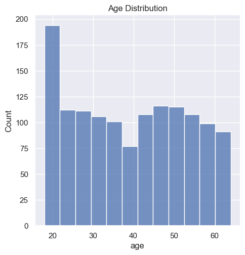
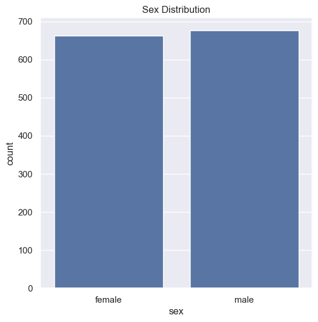
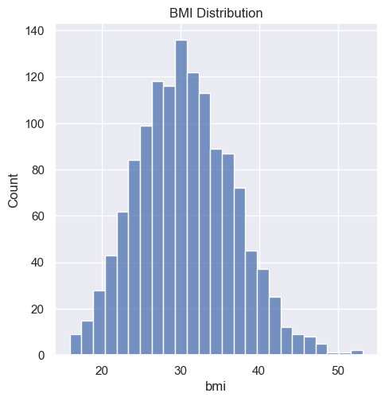
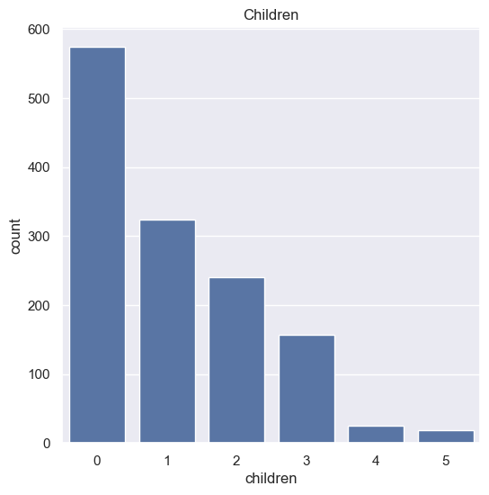
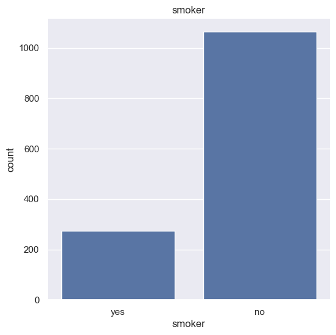
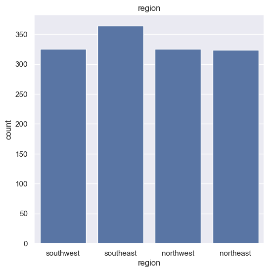
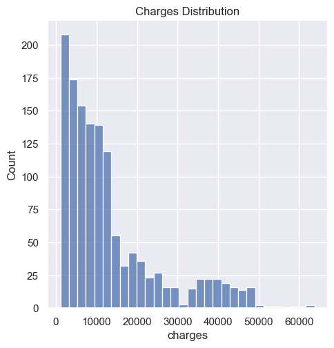

## Medical Insurance Cost Prediction (Linear Regression)

This project predicts *medical insurance charges* based on a person's demographic and health information using *Machine Learning (Linear Regression)*.  
The dataset includes features like age, gender, BMI, smoking status, number of children, and region.

---

## Objective

The objective of this project is to build a Machine Learning model that can accurately predict *medical insurance costs* based on personal and lifestyle factors such as age, BMI, smoking habits, number of children, and region.  
This helps insurance companies, healthcare providers, and individuals estimate premium charges in advance.

---

## Key Features

- Predicts insurance charges using Linear Regression  
- Includes complete Exploratory Data Analysis (EDA) with visualizations  
- Handles categorical feature encoding (sex, smoker, region)  
- Train & test performance comparison using R² score  
- Clean and reusable Python code in Jupyter Notebook  
- Accepts custom user input for real-time cost prediction  
- Lightweight model – can be deployed or integrated into apps  

---

## Exploratory Data Analysis (EDA)

### 🔹 Age Distribution  

### 🔹 Gender Count  

### 🔹 BMI Distribution  

### 🔹 Children Count  

### 🔹 Smoker vs Non-Smoker  

### 🔹 Region Count  

### 🔹 Charges Distribution  

---

## Tech Stack

Language → Python  
Libraries → Pandas, NumPy, Scikit-learn, Matplotlib, Seaborn  
Environment → Jupyter Notebook  
Model Type → Linear Regression  
Dataset Source → Kaggle (Medical Cost Personal Dataset)

---

## Machine Learning Model

Algorithm → Linear Regression  
Train/Test Split → 80% / 20%  
Evaluation Metric → R² Score  
Train R² → 0.7515  
Test R² → 0.7447  

✅ The model performs consistently on both train & test data.

---

## Dataset Details

Rows → 1338  
Columns → 7  
Type → Numeric + Categorical variables  
Target Column → charges

---

## Feature Description

age → Age of the person  
sex → 0 = male, 1 = female  
bmi → Body Mass Index  
children → Number of dependents  
smoker → 0 = yes, 1 = no  
region → 0 = southeast, 1 = southwest, 2 = northeast, 3 = northwest  
charges → Target variable (insurance cost in USD)

---

## Example Prediction

input_data = (31, 1, 25.74, 0, 1, 0) 
The insurance cost is USD 3760.08

---

## How to Run

1. Clone the repository
2. Install dependencies pip install -r requirements.txt
3. Open the Jupyter Notebook
4. Run all cells to train the model and generate predictions  
5. Enter custom input values in the last cell to get real-time insurance cost output

---
